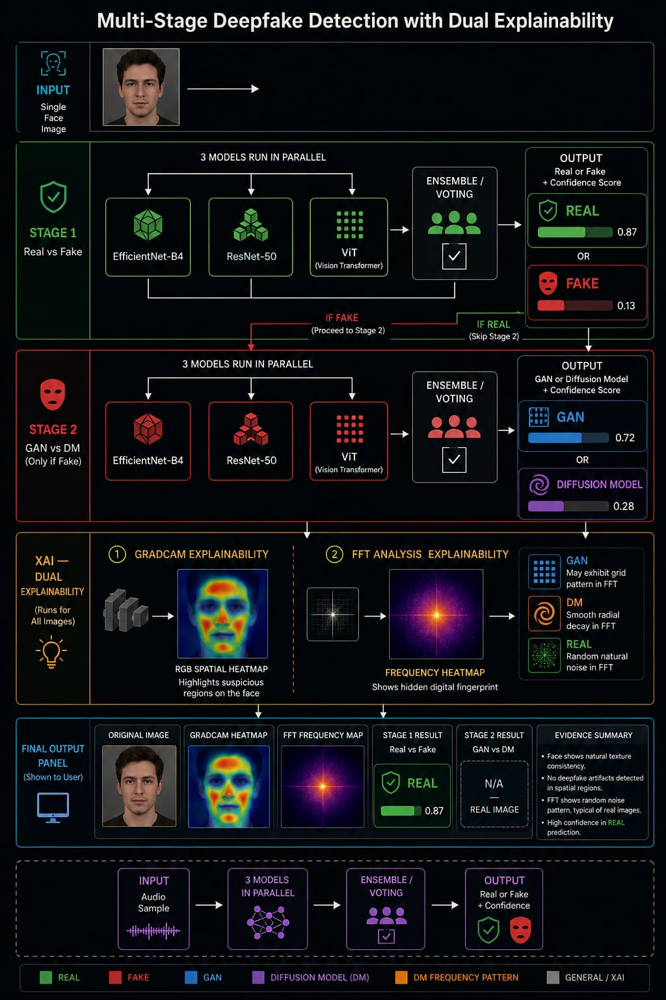
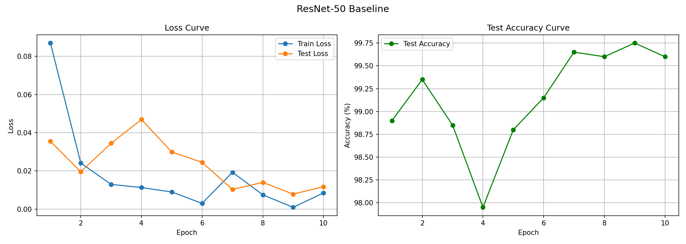
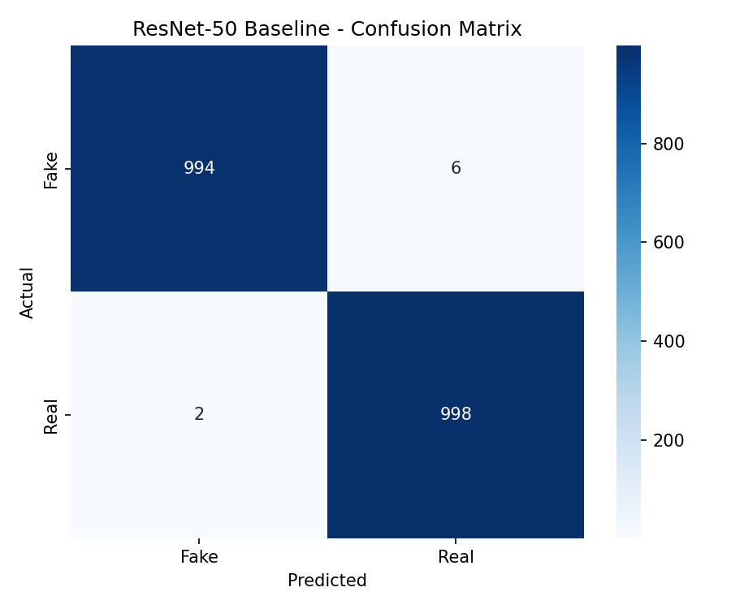

# Multi-Stage Deepfake Detection with Dual Explainability: Spatial and Frequency Domain Analysis

> **Graduation Project 1 (GP1) Proposal & Baseline Implementation**
>
> **Department of Computer Science and Artificial Intelligence**  
> **Jordan University of Science and Technology, Irbid, Jordan**

---

## 📄 Academic Paper

The full proposal paper for this graduation project is included in this repository. 

### [📥 Download Paper PDF](paper/GP1.pdf)

### Abstract
> The rapid advancement of generative artificial intelligence has made synthetic media increasingly indistinguishable from authentic content, posing significant threats to digital trust, media integrity, and public security. Existing deepfake detectors treat this problem as a binary classification task—real versus fake—without differentiating between the distinct generative technologies responsible for the manipulation, thereby limiting their forensic utility and providing no interpretable evidence of the underlying generative process.
> 
> This paper proposes a multi-stage deepfake detection system comprising two main branches integrated under a unified web platform. The image branch employs a two-stage hierarchical ensemble of three deep learning architectures to first distinguish authentic from artificially generated facial images, and then identify whether a detected fake originates from a generative adversarial network or a diffusion model. A dual explainability module accompanies every decision by producing an ensemble-consistent gradient-based spatial activation map highlighting forgery regions alongside a frequency-domain heatmap that reveals supportive spectral indicators of the generative process. The audio branch extracts cepstral and spectral features from speech signals and classifies them as genuine or synthetic using a hybrid convolutional–recurrent architecture, evaluated on a standard anti-spoofing benchmark.
> 
> Preliminary dataset analysis on a balanced corpus of 51,000 facial images sampled from a large-scale demographically annotated collection motivates the proposed pipeline. Quantitative detection performance, explainability quality, and platform latency will be reported in full during the implementation phase. The proposed platform constitutes, to the best of our knowledge, the first system to jointly offer multi-stage hierarchical detection, three-model ensemble voting, dual spatial-frequency explainability, and hybrid audio deepfake detection within a single deployable tool, providing actionable forensic intelligence across both image and audio modalities.

---

## 🛠️ System Architecture

The proposed system consists of two parallel and independent branches—an **Image Branch** and an **Audio Branch**—integrated under a unified Gradio-based web interface.

### Proposed System Architecture



---

## 🎯 Key Project Objectives

1. **Multi-Stage Image Classification:** A hierarchical workflow that first separates real images from deepfakes, and subsequently classifies the deepfakes based on their origin (Generative Adversarial Networks vs. Diffusion Models).
2. **Ensemble-Based Inference:** Reducing individual model bias by voting among three diverse models: EfficientNet-B4, ResNet-50, and Vision Transformer (ViT).
3. **Dual Explainability (XAI):** Providing a spatial explainability map via averaged Grad-CAM, combined with a 2D FFT frequency magnitude spectrum to identify generative frequency artifacts.
4. **Audio Deepfake Detection:** Detecting synthetic speech and voice clones using Mel-Frequency Cepstral Coefficients (MFCCs) and Mel spectrograms fed into a hybrid CNN-LSTM architecture.
5. **Unified Web Platform:** Integrating both audio and image branches into a single interactive web interface built with Gradio for user-friendly testing.

---

## 📊 Phase 1: Baseline Model (ResNet-50)

For **Graduation Project 1**, a binary classification baseline model was successfully trained to validate the feasibility of real vs. fake classification.

### Baseline Training Details

| Parameter | Details |
|---|---|
| **Architecture** | ResNet-50 (Pretrained on ImageNet) |
| **Task** | Binary Classification (Real vs. Fake) |
| **Train Set** | 8,000 images (4,000 Real + 4,000 Fake) |
| **Test Set** | 2,000 images (1,000 Real + 1,000 Fake) |
| **Optimizer** | Adam (Learning Rate = 0.0001) |
| **Epochs** | 10 |
| **Peak Test Accuracy** | **99.75%** |
| **Final Test Accuracy** | **99.60%** |

### Training & Validation Curves


### Confusion Matrix


---

## 📂 Repository Structure

```
GP1/
├── EDA/
│   └── EDA.ipynb                 # Exploratory Data Analysis notebook
├── baseline/
│   ├── resnet50_baseline.ipynb   # Baseline ResNet-50 training script
│   └── results/
│       ├── baseline_curves.png   # Train/Test loss & accuracy graphs
│       └── confusion_matrix.png  # Baseline confusion matrix
├── paper/
│   ├── GP1.pdf                   # Complete GP1 Proposal Paper (PDF)
│   └── architecture.jpeg         # Proposed system architecture diagram
├── README.md                     # Project documentation
└── .gitignore
```

---

## 👥 Authors & Team Members

All authors are undergraduate students in the Department of Computer Science and Artificial Intelligence at Jordan University of Science and Technology (JUST).

| Name | Email |
| :--- | :--- |
| **Mohammad Amjad Al-Qudah** | maalqedah23@cit.just.edu.jo |
| **Hussein Mohammad Freihat** | hmfreihat23@cit.just.edu.jo |
| **Saba'a Yazeed Al-Azzam** | syalazzam22@cit.just.edu.jo |
| **Yazan Ziad Al-Zydanyen** | yzzydanyen23@cit.just.edu.jo |
